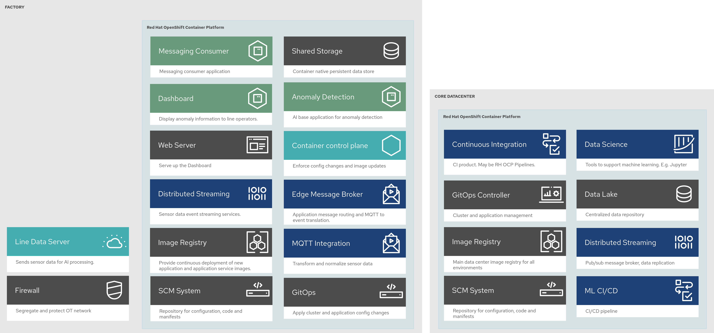
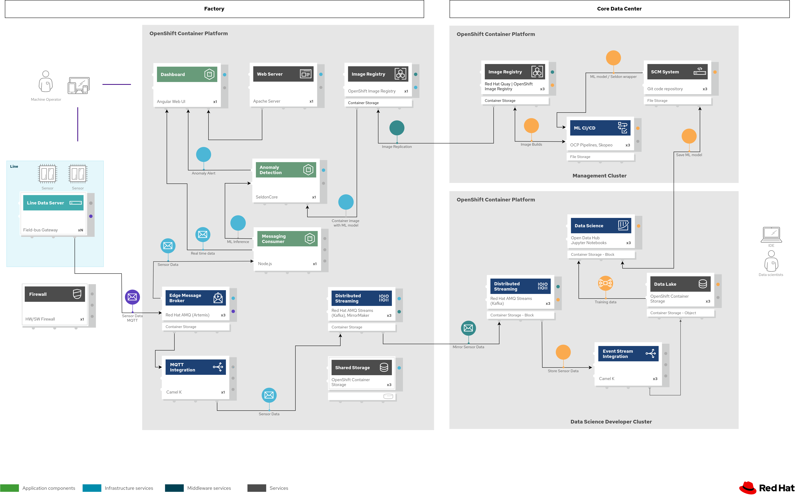

# Prerequisites

1. An OpenShift cluster ( Go to https://console.redhat.com/openshift/create )
1. (Optional) A second OpenShift cluster
1. A github account
1. A quay account

The use of this blueprint depends on having at least one running Red Hat
OpenShift cluster. It is desirable to have a cluster for deploying the data
center assets and a seperate cluster(s) for the factory assets.

If you do not have a running Red Hat OpenShift cluster you can start one on a
public or private cloud by using [Red Hat's cloud
service](https://console.redhat.com/openshift/create).

# How to use

1. Fork this repo on GitHub. It is necessary to fork because your fork will be updated as part of the GitOps and DevOps processes.

1. Clone the forked copy

   `git clone git@github.com:your-username/blueprints.git`

1. Create a local copy of the Helm values file that can safely include credentials

  DO NOT COMMIT THIS FILE
  You do not want to push personal credentials to GitHub.
   ```
   cp blueprints/manufacturing-edge-ai-ml/main/values.yaml ~/values-secret.yaml
   vi ~/values-secret.yaml
   ```

1. Preview the changes
   ```
   cd blueprints/manufacturing-edge-ai-ml/main
   helm template manuela . --values ~/values-secret.yaml --debug
   ```
## Datacenter

TIP: It is recommended to have two shells open so that you can switch between datacenter and factory clusters to run commands. 

1. Login to your cluster using oc login or exporting the KUBECONFIG

   `oc login`  
   or 
   
   `export KUBECONFIG=~/my-ocp-env/datacenter`

1. Apply the changes to your cluster

   `helm install manuela . --values ~/values-secret.yaml`
   
1. Check the operators have been installed 

   `UI -> Installed Operators`

1. Obtain the ArgoCD secret

   `oc -n openshift-gitops extract secrets/openshift-gitops-cluster --to=-`

1. Obtain the Cluster ArgoCD location and log in

   `oc get -n openshift-gitops routes/openshift-gitops-server`
   
1. Check all applications are synchronised

1. To deploy a edge cluster you will need to get the datacenter (or hub) cluster's token. You will need to install `clusteradm`.  On the existing datacenter cluster:

   `clusteradm get token`

## Factory

1. When you run the `clusteradm` command above it replies with the token and also shows you the command to use on the factory. So first you must login to the factory cluster

   `oc login`
   or
   
   `export KUBECONFIG=~/my-ocp-env/factory`

1. Then request to that the factory join the datacenter hub

   `clusteradm join --hub-token <token from clusteradm get token command > <factory cluster name>`

1. Back on the hub cluster accept the join reguest 

   `clusteradm accept --clusters <factory-cluster-name>`

1. Use Helm to deploy the factory cluster assets.


# Structure

https://docs.google.com/presentation/d/e/2PACX-1vSfbN_TbjfYnw-B6hHs-uUQ-8rRzUX27AW4eSxT7dVmBERiBgHS_FWWkgyg5fTsEWL2hj6RYyJqYi7_/pub?start=false&loop=false&delayms=3000

# Uninstalling

1. Turn off auto-sync

   `helm upgrade manuela . --values ~/values-secret.yaml --set gitops.syncPolicy=Manual`

1. Remove the ArgoCD applications (except for manuela-datacenter)

   a. Browse to ArgoCD
   a. Go to Applications
   a. Click delete
   a. Type the application name to confirm
   a. Chose "Foreground" as the propagation policy
   a. Repeat

1. Wait until the deletions succeed

   `manuela-datacenter` should be the only remaining application

1. Complete the uninstall

   `helm delete manuela`

1. Check all namespaces and operators have been removed

# Diagrams

The following diagrams show the different components deployed on the datacenter and the factory.

## Logical



## Schematic with Networks


## Schematic with Dataflows



## Editing the diagrams.

To edit the diagrams in Draw.io you can load them [here](https://redhatdemocentral.gitlab.io/portfolio-architecture-tooling/index.html?#/portfolio-architecture-examples/projects/Mfg-AI-ML-0928.drawio) and save a local copy
